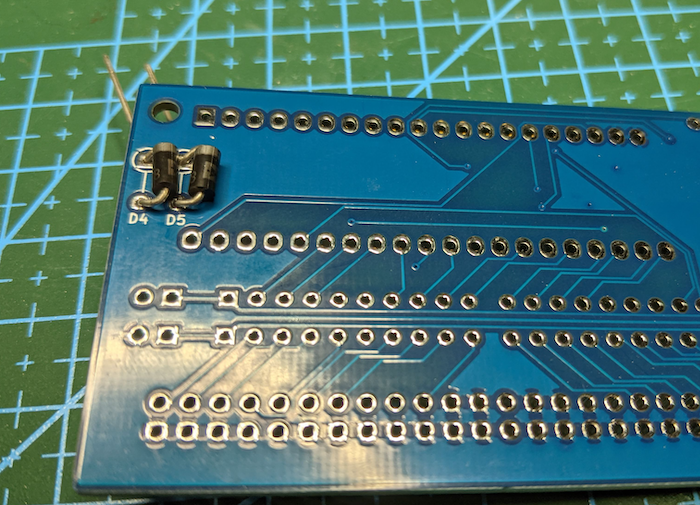
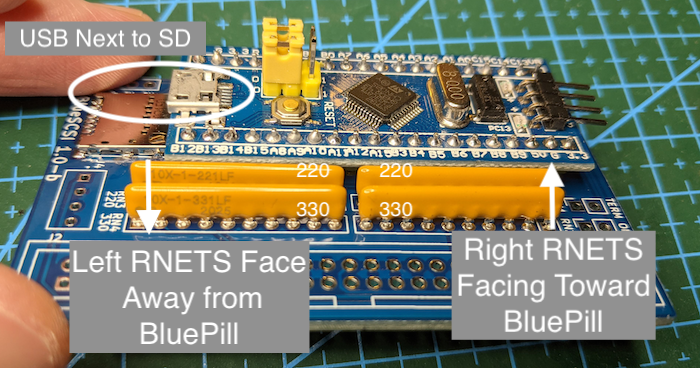
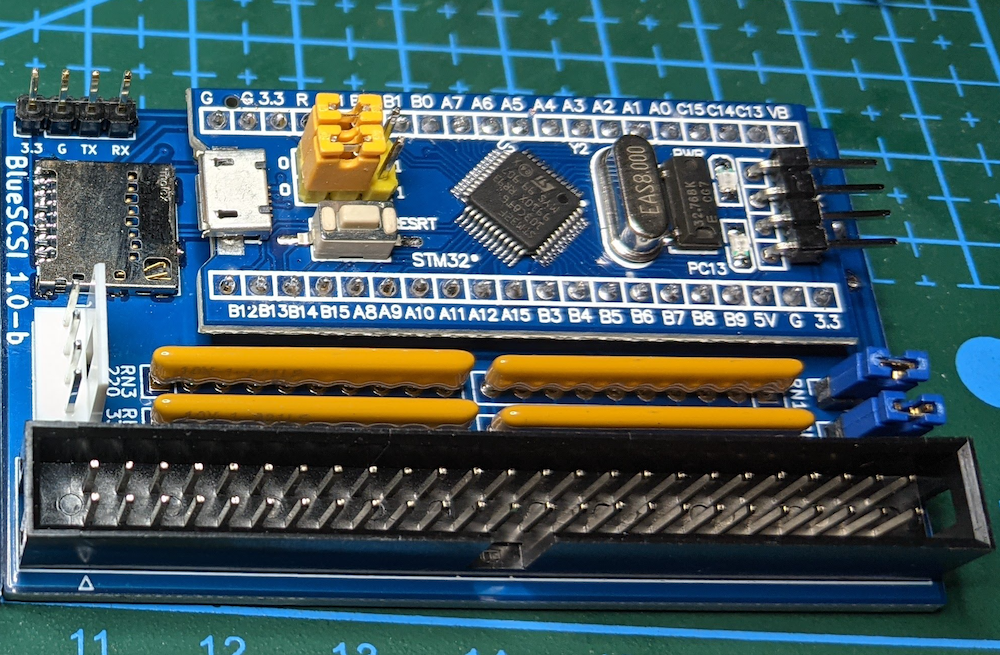

# Assembly

## Before you start

Read through all instructions before starting.

## Building

1. Solder on the surface mount SD Card holder. Use the [Drag Solder](https://youtu.be/Z_KL4fWOMug) technique.
    - Once on, check continuity of all connections. Fixing this after the BluePill is on will be difficult.
    - Ensure the SD card fits and you dont have too much solder on the sides or contacts
2. Solder the dioeds to the **bottom** of the board. Be sure they are flush as possible to the bottom.

3. Solder the header pins on to the BluePill. Then BluePill pill to the BlueSCSI PCB.
    - Correct orientation is having the USB connector of the BluePill should be over the SD Card holder.
4. Solder on the resistor nets. Pin one is marked on the board and the resistors.
   - 220 RNETS (`RN1` & `RN3`) are closest to the BluePill
     - Note PIN one on each - they are opposite of eachtoher. See photo.
   - 330 RNETS (`RN2` & `RN4`) are furthest from the BluePill
     - Note PIN one on each - they are opposite of eachtoher. See photo.

5. Solder on the Termination Jumpers & place the jumpers on to enable Termiation
6. Solder the 50 Pin headers on.
   1. Note Pin 1 and Box header on the silk screen.
7. Optional - Solder on the berg connector. Only needed if your machine does not supply enough power via the SCSI bus.
8. Optional - Solder on the debug headers near the SD card. Only nessissarry if re-programming.

### Fully Assembled

### Version 1.0-b BOM

STM32F103C8T6 (U1) aka BluePill board. Beware of fake/scams. Look for reviews. Amazon, ebay, etc.

Mouser Cart https://www.mouser.com/ProjectManager/ProjectDetail.aspx?State=EDIT&ProjectGUID=db967d46-a51a-4a0e-a350-8f503b2f02cf

* 2x 330 (RN2, RN4) Resistor nets https://www.mouser.com/ProductDetail/652-4610X-1LF-330

* 2x 220 (RN1, RN3) Resistor nets https://www.mouser.com/ProductDetail/652-4610X-1LF-220

* 2x Diodes https://www.mouser.com/ProductDetail/583-1N5818-T

* SD Card Holder (J1)  https://www.mouser.com/ProductDetail/538-104031-0811

* Headers https://www.mouser.com/ProductDetail/872-920-0011-01

* 50 PIN SCSI header https://www.mouser.com/ProductDetail/517-30350-6002/
  - May substitute with 2 rows of headers from above.
  - **Note on Right angle connectors** - it appears Right angle headers are notched differently then the pin out. Be sure to note PIN 1/red stripe on the cable match up.

### Optional

Floppy/Berg Power header https://www.mouser.com/ProductDetail/571-1718254
  - Required if your machine does not supply power via TERM POWER. For example a Mac Plus or Mac with a Analog/PSU board that has not been recapped.
